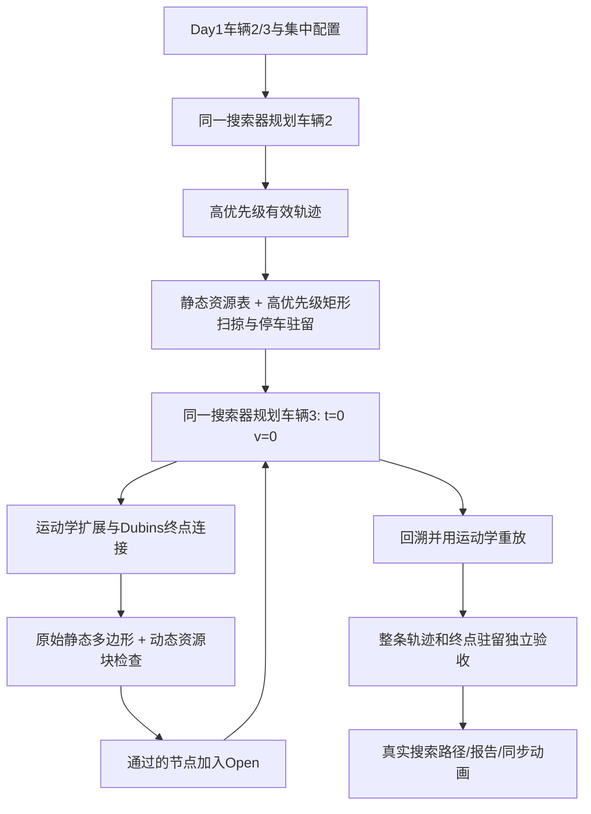

# Day 6：顺序多车规划与动态碰撞接入

2026-10-07 更新：运行效率优化、五档转角、真实倒车与 0.5s 停稳换挡及最新场景的重复计时见 [day6_performance_reverse.md](day6_performance_reverse.md)。下文初次 Day6 的数值保留为历史记录；当前运行结果以最新性能报告与 `outputs/day6_validation.json` 为准。

## 1. 目标与当前验证状态

本阶段把 Day4 的五维 V-Hybrid A* 搜索器与 Day5 的 X-Y-T 资源表连接起来。按固定优先级先计算 `vehicle_002`，再把其车辆矩形及轨迹段扫掠写入资源块，最后从同一个绝对时钟 `t=0` 计算 `vehicle_003` 的避让路径。两车使用同一搜索器、同一车辆运动学、同一车辆尺寸和同一搜索配置。

实现范围为优先级解耦的轨迹搜索与碰撞检查。加速度、巡航速度是搜索控制候选；本阶段没有进行论文后续的连续轨迹优化、完整速度优化、优先级重新排序、联合优化或控制器仿真。

已在 MATLAB R2023a（9.14.0.2206163）实际运行单元测试及 Day1 两车顺序规划，所有验收通过。以下数值来自实际模型积分与搜索结果；完整记录见 `outputs/day6_validation.json` 和 `outputs/day6_sequential_report.json`。

| 检查 | 最终结果 |
| --- | --- |
| Day6 动态碰撞/搜索接入单元测试 | 54/54通过 |
| Day3 车辆运动学回归 | 8/8通过 |
| Day4 搜索回归 | 17/17通过 |
| Day5 资源表回归 | 54/54通过 |
| 测试合计 | 133/133通过，0失败，0未完成 |
| Day1 车辆2/3真实顺序规划 Demo | 两车同为t=0、v=0，第一运动边a=2m/s²，最终停车且运动学有效 |
| 两车到达时间 | 车辆2为10.760639s，车辆3为13.534503s |
| 两车最高速度 | 车辆2为1.5m/s，车辆3为3.5m/s |
| 最小车身净距 | 采样值2.106m，保守连续下界1.887m（完整精度见JSON） |
| 动态资源交集 | 搜索接口与独立Day5双车写入复核均为0块，含停车至60s的驻留 |
| PNG 与同步动画输出 | 实际生成搜索轨迹图、v-t图及同步GIF |

## 2. 文件与调用关系

所有召集代码仍位于独立 `matlab/single_vehicle/` 模块，原始 APA `.slx`、`Local_Planner` 和停车状态机不参与改动。

| 文件 | 职责 |
| --- | --- |
| `dynamic_vehicle_obstacle.m` | 校验并封装高优先级带时间轨迹、车辆尺寸、ID及终点驻留策略 |
| `predict_vehicle_pose.m` | 在同一绝对时间预测 `[x,y,theta,v,t]`；支持向量时间查询与停车驻留 |
| `check_vehicle_vehicle_collision.m` | 圆/AABB预筛选、旋转膨胀矩形 SAT最终判定、真实车身净距 |
| `check_trajectory_conflict.m` | 候选整段动态资源约束和连续矩形检查，返回冲突及距离报告 |
| `summon_vhybrid_astar.m` | Day4/Day6共用搜索器，起终点校验、五维Open/Closed、回溯与最终验收 |
| `vhybrid_expand_node.m` | 接收资源地图和高优先级轨迹，对加速/匀速/减速整段检查后生成子节点 |
| `vhybrid_goal_connection.m` | Dubins连接也执行动态约束及终点驻留检查；动态冲突允许其他速度候选 |
| `vhybrid_dubins_candidates.m` | 启发与终点连接共享六类曲线公式，按总弧长排序 |
| `vhybrid_heuristic.m` | Day6采用无障碍最短Dubins弧长，统一起点/子节点启发代价 |
| `vhybrid_curve_boundary_check.m` | 对矩形道路解析检查全部车角圆弧极值，提前拒绝必越界曲线 |
| `day6_motion_trajectory.m` | 使用既有自行车模型生成候选边的密集状态及加速度/转角控制 |
| `day6_trajectory_states.m` | 校验公共轨迹接口、时间递增和非负速度，并解开航向角环绕 |
| `day6_resource_blocks.m` | 按Day5的半开时间层和矩形栅格约定生成候选车身扫掠资源索引 |
| `prepare_dynamic_context.m` | 缓存包含全部高优先级车辆的动态占用掩码和每层保守包络 |
| `day6_static_collision_check.m` | 按实际车辆航向与原静态多边形检查完整车身，避免静态重复膨胀 |
| `run_day6_sequential_planning_demo.m` | 加载Day1配置，顺序规划两辆车，同时起步硬验收，保存结果/失败诊断 |
| `plot_day6_trajectories.m` | 从实际搜索结果生成轨迹/搜索节点、v-t、距离图及同步GIF |
| `tests/test_dynamic_collision.m` | 追尾、交叉、时间错开、等待及搜索集成等可执行单元测试 |
| `tests/validate_day6_sequential.m` | 一键运行133项回归及真实两车Demo，保存验收JSON |
| `config/planner_config.json` | 集中配置Day6开关、碰撞采样、裕度、驻留和动画步长 |

`run_vhybrid_astar_demo.m` 保留 Day4 入口及输出方式，委托同一个 `summon_vhybrid_astar.m`。其无动态上下文的调用仍是单车搜索。`vhybrid_cost.m` 新增可选启发权重，默认权重为1；Day6 Demo仅在内存配置副本中使用Day6指定权重。



## 3. 状态、单位与公共接口

状态统一为 `[x,y,theta,v,t]`。`x/y` 是后轴中心坐标，单位米；`theta` 是车身航向，单位弧度；`v` 是非负纵向速度，单位米/秒；`t` 是从本次任务 `t=0` 起算的绝对时间，单位秒。轨迹是有限 `N×5` 数组，或包含等长 `x/y/theta/v/t` 字段的有效 `path`。时间必须严格递增，单点轨迹允许用于瞬时状态检查。

```matlab
obstacle = dynamic_vehicle_obstacle(path, vehicle_config, 'vehicle_002', planner_config);
[states, active] = predict_vehicle_pose(obstacle, query_times_s);

[collision, detail] = check_vehicle_vehicle_collision( ...
    ego_state, obstacle_state, ego_vehicle_config, obstacle_vehicle_config, planner_config.day6);

[collision, report] = check_trajectory_conflict( ...
    candidate_path, obstacles, ego_vehicle_config, planner_config, st_map);

path = summon_vhybrid_astar(start_state, goal_state, geometry, ...
    vehicle_config, planner_config, st_map, higher_priority_trajectories);
```

搜索器最后两个参数可省略或为 `[]`。高优先级车辆的接口包含 `id`、`states`、`vehicle_config`、`footprint` 和 `hold_end`。一组高优先级车辆用结构数组表示；本日 Demo 中该数组仅含车辆2。

预测采用时间线性插值：位置和速度在相邻轨迹样本间插值，航向先 `unwrap` 再插值，返回时规范到 `[-pi,pi)`。起点之前不外推；末点以后只有 `hold_end=true` 才保持末位置/航向和零速度。高优先级输入来自运动学积分的密集真实轨迹。

## 4. 运动学与连续段检查

所有搜索节点扩展、连接节点、回溯细分与带控制的自车验收都复用 `summon_vehicle_dynamic.m`。基本关系为：

```text
v_next = v + a*dt
ds = (v + v_next)*dt/2
curvature = tan(delta)/wheelbase
theta_next = theta + ds*curvature
t_next = t + dt
```

位置按照直线或定曲率圆弧积分，遵守集中配置的速度、加速度和转角限制。路径末端不直接赋值目标位置或航向。

普通加速、匀速和减速边都检查中间状态及候选整段扫掠。`day6_motion_trajectory` 同时按时间步长和运动距离生成采样，并包含边的中点。减速边在扩展器内额外加密静态检查，不仅检查末节点。

同一个转向的加速度候选按从低到高排序。若减速边的中间节点发生静态或动态冲突，该减速候选被拒绝，并停止该转向后续更高速的候选；其他转向仍可继续。此规则会记录 `braking_midpoint_pruned` 和 `faster_controls_skipped`。它是本阶段按给定复现要求执行的剪枝策略，不代表对所有非结构化场景都具有搜索完备性。

终点连接没有绕过动态检查。每个真实运动学 Dubins 连接候选均检查其整段资源；若为动态冲突，可继续尝试同一几何曲线的其他巡航速度。末速度仍须为0，不允许因避让临时改写停车约束。

## 5. 资源块、静态几何与矩形判据

Day5约定保持不变：资源块为 `occupancy(ix,iy,it)`，空间与时间区间都是半开区间，`x_coords/y_coords/t_coords` 为块中心。标记和查询使用相同索引计算，`t=t_max` 及空间上界不可作为自由状态。

高优先级轨迹经车辆矩形安全膨胀后调用 `mark_trajectory_occupancy` 写入资源表。每条轨迹段先按时间层边界切分，再在层内扫掠采样；栅格化使用旋转矩形与整块的交集，并加入采样间隙补偿。低优先级候选采用一致的矩形与扫掠约定生成资源索引，只要与高优先级的动态块重叠，就保守拒绝。即使两个采样时刻的物理矩形未相交，同一半开时间块内的资源冲突仍可能被拒绝。

资源表仍保存永久静态/边界占用，以及与动态车辆重叠时的全部归属。`prepare_dynamic_context` 会从主归属和重叠归属中提取所有动态块，不能因块的主归属为静态而丢失高优先级车辆。每层动态包络只用来安全排除明显远离的候选；包络相交后仍执行完整旋转矩形资源查询。圆、AABB和层包络均不能作为最终碰撞判据。

Day5静态表为了没有航向维的地图，采用全航向的车身圆包络膨胀。该表对靠近边界但实际航向合法的车辆可能过于保守。例如车辆2的原起点 `(27,17,pi)`，后轴点接近边界，但朝左的实际车身仍可位于场地内。Day6静态检查因此对**原始边界/障碍物几何与已有裕度的实际航向车身矩形**进行一次判定；不把车身再与已按整车膨胀的静态块作第二次膨胀判断。检查同时覆盖车角落入、障碍被车身包住和双方边相交，凹边界还检查车身边穿越场外的情形。

车辆对车辆的最终几何检查使用四个分离轴的 SAT旋转矩形。矩形包含车辆配置中的前、后、侧安全裕度，额外车间裕度分摊到两车。圆包围与轴对齐包围盒仅执行快速预筛选及诊断统计。真实车身最小净距使用不含安全膨胀的矩形边界距离；相交时净距为0。

完整轨迹验收在采样之间加入基于车角运动上界的矩形膨胀补偿。报告给出 `minimum_distance_m` 的采样车身净距和 `minimum_distance_lower_bound_m` 的保守连续下界，不把采样最小值表述为精确解析的全时间最小值。

## 6. 同时起步、等待与停车驻留

Demo直接读取 `scenario_001.json` 中的车辆2和车辆3：

| 车辆 | 优先级角色 | 原起点 `[x,y,theta]` | 原目标 `[x,y,theta]` |
| --- | --- | --- | --- |
| `vehicle_002` | 先计算并预留资源 | `[27,17,pi]` | `[15,9,pi]` |
| `vehicle_003` | 后计算并避让资源 | `[4,17,-pi/2]` | `[24,15,pi/2]` |

两辆车均输入 `v=0、t=0`。在 Demo最终验收中，第一条真实运动边必须正加速，不能在起步前插入等待或平移整条轨迹时间轴。车辆从静止出发的瞬时速度为0，之后随加速度连续增大；“同时起步”不要求在 `t=0` 瞬间速度非零。

起步以后搜索允许正常减速到0，再用 `v=0、a=0` 的时间推进边等待；该等待节点具有新时间索引和时间代价，并持续占用实际车身资源。测试中安全等待和在冲突区域内的不安全等待分别验证。

当 `goal_hold_enabled=true`，高优先级车到达召集点后持续占用到 `t_max`；低优先级成功路径同样检查到达后的驻留时段。时间范围是半开的，因此检查末点取略小于 `t_max` 的数值。只有末速为0的轨迹可以执行停车驻留。

## 7. 集中配置与代价

地图空间/时间范围与 `dx/dy/dt` 仍位于 `planner_config.st_occupancy`。`validate_st_occupancy_config` 检查搜索步长是资源层步长的正整数倍；当前搜索步长和资源时间层均为0.5秒。

| `planner_config.day6` 字段 | 默认值 | 作用 |
| --- | ---: | --- |
| `enabled` | `true` | Day6模块状态说明 |
| `require_immediate_start` | `true` | 动态上下文根节点只接受正加速起步；Demo另作两车硬验收 |
| `goal_hold_enabled` | `true` | 终点停车持续占用时域 |
| `collision_sample_step_s` | `0.05` | 连续段时间采样上限，秒 |
| `collision_sample_step_m` | `0.1` | 候选运动段距离采样上限，米 |
| `minimum_safety_distance_m` | `0.0` | 两车已有安全矩形之外的额外车间距离，米 |
| `animation_step_s` | `0.2` | 动画采样步长，秒 |
| `animation_frame_rate` | `10` | GIF播放帧率 |
| `max_conflict_examples` | `10` | 每次搜索保存的冲突实例上限 |
| `search_heuristic_weight` | `2.0` | Day6 Demo的加权启发引导 |
| `heuristic_method` | `dubins` | 同车辆最小转弯半径的非完整运动学距离启发 |

已有车辆前/后/侧裕度各为0.2米，默认额外安全距离为0并不表示没有安全裕度。上述采样、安全距离、启发权重是原型配置；论文复现精度与实车参数需进一步确认。

`g` 累计实际行驶距离、速度变化、参考速度偏差、航向变化和时间代价；可选 `vhybrid.heuristic_weight` 仅乘到目标启发项 `h`，并保持 `f=g+h`。Day6 Demo把集中配置的权重传给两辆车，而 Day4入口默认权重为1。权重大于1优先引导搜索朝目标推进，**不保证全局最优路径**；现有启发项与剪枝也不构成严格的最优性/完备性证明。

## 8. 输出、拒绝统计与失败接口

单车输出保留 Day4的 `x/y/theta/v/t/direction/valid/error_code/search_statistics`，并添加或保留控制量、终点误差、`kinematic_validation`、`dynamic_validation`、`failure_diagnostics`。

`check_trajectory_conflict` 主要输出：

| 字段 | 含义 |
| --- | --- |
| `collision` | 动态资源冲突或保守矩形冲突的总体标志 |
| `reason` | `dynamic_resource_block`、`vehicle_rectangle_swept`、`outside_time_space_bounds`等原因 |
| `resource_conflict` | 动态资源交集或非法时空范围；非法范围永久拒绝 |
| `rectangle_collision` / `physical_collision` | 前者是安全/扫掠膨胀矩形命中，后者是原始物理车身接触或相交 |
| `filter_statistics` | 圆/AABB/矩形命中数，以及圆/AABB相对最终矩形的假阳性数 |
| `obstacle_id` | 冲突高优先级车辆的外部ID |
| `conflict_time_s` / `conflict_position_xy` | 首个报告冲突的时间与位置；资源冲突位置为对应块中心 |
| `minimum_distance_m` | 不含安全裕度的真实车身采样最小净距 |
| `minimum_distance_lower_bound_m` | 考虑采样间运动上界后的保守净距下界 |
| `resource_indices` | 冲突资源块的三维线性索引，不是所有已查块的列表 |
| `resources_checked` / `checked_samples` | 查询资源块数量和矩形时间样本数量 |
| `distance_samples` | 两列 `[t,车身净距]` |
| `has_intermediate_conflict` | 冲突是否位于候选段内部，用于减速剪枝 |
| `distance_evaluated` | 是否实际计算过距离；试探搜索可关闭距离统计 |

规划试探调用可设置 `options.collect_distance_samples=false`，保留矩形扫掠资源约束，减少重复净距计算；完整轨迹独立验收默认打开距离与矩形时间采样。

搜索统计提供 `collision_pruned_nodes`、`constraint_pruned_nodes`、`dynamic_pruned`、`resource_pruned`、`braking_midpoint_pruned`、`faster_controls_skipped`、`waiting_nodes`、`horizon_pruned`、`reason_counts` 和有限数量的 `conflict_examples`。`dynamic_pruned`包括动态资源和矩形拒绝，`resource_pruned`单独记录资源拒绝，不能将两者相加当作互斥总数；统计单位为候选扩展或连接。当前低优先级搜索扩展29个Open节点，动态资源拒绝187次，减速中间检测拒绝18次，跳过同转向后续高速控制70次。解析边界剪枝另计 `goal_connection_geometric_candidates` 和 `goal_connection_boundary_pruned`，本场景分别为121/94条曲线。

| 错误码 | 原因 |
| ---: | --- |
| 0 | 成功 |
| 1 | 输入状态非法 |
| 2 | 起点静态碰撞 |
| 3 | 目标静态碰撞 |
| 4 | Open耗尽，当前离散控制/配置无解 |
| 5 | 搜索节点上限 |
| 6 | 搜索计算超时 |
| 7 | 终点位置/航向/停车速度未通过验收 |
| 8 | 轨迹运动学验收失败 |
| 9 | 起点动态资源或矩形冲突 |
| 10 | 整条路径或停车驻留动态验收失败 |
| 11 | 时空规划时间范围耗尽 |

低优先级失败时返回明确的 `failure_diagnostics.reason`、错误码、拒绝分类、可调整速度范围及进入时间列表；Demo报告也记录可调整范围。它们是调参诊断，不会自动更改车辆初始 `t=0`、重新排序、平移高优先级轨迹或实施速度优化。搜索超时表示计算预算耗尽，不等同于数学上已证明无解。

成功并验收后输出：

| 文件 | 内容 |
| --- | --- |
| `outputs/day6_sequential_report.json` | 成功/失败状态、两车起终点、搜索与资源统计、碰撞及失败诊断 |
| `outputs/day6_sequential_trajectories.mat` | 完整 `result`、真实搜索路径、控制与搜索节点 |
| `outputs/day6_search_trajectories.png` | 两车实际XY轨迹、搜索节点、车身方向、v-t和矩形净距 |
| `outputs/day6_speed_time.png` | 共用绝对时钟的两车速度曲线，先到达者继续显示零速度 |
| `outputs/day6_sequential_planning.gif` | 同时从静止起步、运动与到达后停车的动画 |
| `outputs/day6_validation.json` | MATLAB版本、133项回归结果和真实两车独立验收 |
| `outputs/day6_source_integrity.json` | 部署文件、原文件备份与未修改文件哈希验证 |

失败时仍保存JSON/MAT，并保留高优先级结果和低优先级失败数据；不把失败或人工预设轨迹绘制成成功动画。重复运行时应以当前报告有效性为准，不能用旧图片作为新一次运行成功的证据。

## 9. 运行与验收

在 MATLAB 中使用实际目标工程路径：

```matlab
project_root = 'F:\study\postgraduate\联培\路径规划论文\代码\辅助\day 4\MATLAB-9.11-45973bf338437f8ae7b9fe154fc587f714a4c0df';
addpath(fullfile(project_root,'matlab','single_vehicle'));
addpath(fullfile(project_root,'tests'));

% 一键运行全部回归、真实Demo和输出验收报告：
summary = validate_day6_sequential(true);

% 只返回结果、不写图片/MAT/JSON：
result = run_day6_sequential_planning_demo(false);
disp(result.validation);

% 输出Day6独立报告和已通过验收的轨迹图/动画：
result = run_day6_sequential_planning_demo(true);

% 可执行模块测试与前期回归：
day6_tests = runtests(fullfile(project_root,'tests','test_dynamic_collision.m'));
day3_tests = runtests(fullfile(project_root,'tests','test_vehicle_dynamic.m'));
day4_tests = runtests(fullfile(project_root,'tests','test_vhybrid_core.m'));
day5_tests = runtests(fullfile(project_root,'tests','test_st_occupancy_map.m'));
disp(table(day6_tests));
```

测试覆盖追尾、交叉中间冲突、同空间不同时间、等待区安全与冲突区等待、快速穿越扫掠、旋转矩形及圆/AABB误差、边界/时间越界、终点长期占用、减速中间节点和后续高速剪枝、加速/匀速/减速、立即起步、公开搜索器起终点及未来驻留检查、加权启发与节点代价一致性。小型合成轨迹仅用于碰撞单元测试；Day1两车Demo的轨迹全部由真实搜索器生成。

真实Demo须同时满足：两条路径有效且运动学有效；两车输入/输出首状态均为 `t=0、v=0`；第一运动边直接受限正加速；到达位置/航向满足Day4容差且末速度为0；完整轨迹及停车驻留的动态资源重叠块数为0；矩形连续验收无碰撞。`result.valid=true` 只在这些条件全部满足后返回。

## 10. 日终记录与后续建议

完成内容：实现高优先级轨迹封装与资源写入、同搜索器低优先级动态扩展、减速中间检测和剪枝、终点停车驻留、矩形净距与分类拒绝、失败接口、可执行测试及真实轨迹可视化入口。修改文件见第2节及最终交付清单。

测试结果：133项测试及真实两车规划全部通过，详见第1节和生成的JSON。额外覆盖整圈转弯中途越界、高速连接严格递增时间、资源包络预筛选等价性和Dubins启发一致性。

图片解释：蓝线是车辆2的高优先级搜索路径，橙线是车辆3的避让搜索路径。橙线先受限加速至3m/s，再加速至3.5m/s，在高优先级车到达交叉区域前通过，并沿下侧转弯到达目标要求的朝北姿态。蓝车10.76s先停下，橙车13.53s停车；速度线段斜率来自真实加速度，没有瞬间改变速度。右下绿线显示实际车身之间的采样净距；二维线相交不代表同一时间碰撞。橙色绕行较长，是当前可行搜索解，尚未做轨迹优化，不宣称最短路径。

搜索实现改进：单纯的欧氏距离低估了接近目标但航向错误的车辆转弯需求。Day6改用与连接共享公式、最小转弯半径由车辆轴距和最大转角计算的Dubins距离；Day4默认仍用原启发。矩形道路上先解析检查完整车角扫过的极值，只有证明越界才整条曲线拒绝。动态资源查询缓存层包络用于安全分离预筛选，并允许试探搜索首个资源命中后结束查询；最终验收完整收集资源。未修改起终点、速度上限或原控制采样，也没有预设两车路径。

修改文件：在集中配置和第2节新增模块之外，调整了 `run_vhybrid_astar_demo.m`、`vhybrid_expand_node.m`、`vhybrid_goal_connection.m`、`vhybrid_cost.m`，以及 `tests/test_st_occupancy_map.m` 中Day5阶段固定关闭优先级的断言；其余Day5验收与Day4原始参数断言保留。Day1–3 MATLAB源文件未改，旧输出未覆盖。

当前限制：离散网格、半开时间层和扫掠膨胀是保守资源约束，可能拒绝物理上可错开的近距离运动；固定优先级与控制采样可能导致低优先级无解或计算超时；加权启发与减速剪枝不保证最优或完整搜索。采样净距和保守下界须分开解读。

后续建议：在本阶段验收通过后，对更多优先级顺序、车辆尺寸和速度采样进行对比，再评估论文后续的重新排序与连续优化；保留本阶段的原始搜索轨迹和碰撞验证报告作为独立基线。本日没有实现完整重新排序、联合优化或轨迹优化。
